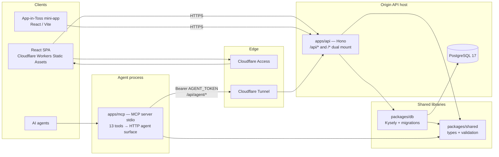

# BrewDial

Agent-friendly coffee recipe and dial-in system.

BrewDial records brewing recipes, bean/gear metadata, and tasting feedback so a
human and an AI agent can iterate on the next brew together. The system is
agent-agnostic — it does not assume any specific agent runtime or chat product.

The service is **operated under access control**, not a mass-market public
product. The web UI sits behind Cloudflare Access; the health endpoints on the
API host respond publicly for ops checks.

## Status

Deployed and operated by the author with restricted web access:

| Surface | Host | Notes |
|---|---|---|
| Web UI (React SPA) | `brewdial.robinco.dev` | Behind Cloudflare Access (login required) |
| HTTP API | `api.brewdial.robinco.dev` | `GET /api/health` is public; most routes need identity or agent token |
| App-in-Toss mini-app | (same domain/API layer) | Built; store/public launch is **not** complete |

Continuous Integration (typecheck, lint, tests with a Postgres service container)
runs on pull requests. Continuous **deployment** automation is still being built.

## Architecture

Five workspace packages, one HTTP contract, three trust boundaries.



### Trust boundaries (why the stack looks like this)

BrewDial did not start here. Each move was a deliberate cut of a trust boundary:

1. **Local document store** — Early MVP used a document DB on a laptop to prove
   the recipe → feedback → agent-context loop with minimal ceremony.
2. **Hosted Postgres + client-direct access** — Data moved to PostgreSQL so
   relations (recipes, beans, gear, ownership) could be enforced. Browser and
   MCP clients talked to the database with separate roles. That worked, but put
   authorization policy next to the data plane and gave clients a direct path
   into storage.
3. **Own API + origin isolation (current)** — A Hono API now owns every write
   path. Clients no longer hold database credentials. The API process and
   Postgres bind to localhost on the origin host; **Cloudflare Tunnel** is the
   only ingress. Edge auth (Cloudflare Access for humans), **user identity** on
   `/me/*`, and a separate **agent bearer token** on `/api/agent/*` are different
   gates — an agent cannot impersonate a user session, and a browser cannot call
   the agent surface without the token.

Cutover was staged by consumer (web SPA, then MCP, then mini-app share the same
API contract) rather than a single big-bang flip, so each client could move when
its path was verified.

### Workspace layout

```text
apps/
  api/        # @brewdial/api — Hono HTTP API (Node)
  mcp/        # @brewdial/mcp — MCP server over stdio (13 tools)
  miniapp/    # @brewdial/miniapp — React + Vite SPA (+ App-in-Toss build)
packages/
  db/         # @brewdial/db — Kysely repositories + node-pg-migrate SQL
  shared/     # @brewdial/shared — shared types, schemas, pure domain logic
```

Notable API details:

- Routes are mounted at **both** `/api/*` and `/*`. MCP and ops use the `/api`
  prefix; the mini-app/web client base URL omits it.
- `GET /api/health` — process liveness (no DB).
- `GET /api/db/health` — `SELECT 1` against Postgres.
- `/api/agent/*` — agent/admin writes; requires `Authorization: Bearer <AGENT_TOKEN>`.

MCP tools (stdio): `brew.create_recipe`, `brew.update_recipe`,
`brew.archive_recipe`, `brew.supersede_recipe`, `brew.find_bean`,
`brew.list_beans`, `brew.update_bean_attributes`, `brew.list_grinders`,
`brew.list_drippers`, `brew.get_recent_context`, `brew.get_recipe_context`,
`brew.create_feedback`, `brew.update_preferences`.

Bean preference recommendations use a **deterministic scoring model** over
structured bean attributes, save history, and the operator's own feedback — not
an opaque LLM call — so match reasons stay inspectable.

## Requirements

- Node.js ≥ 22
- pnpm 10.33.2 (pinned via `packageManager` in root `package.json`)
- PostgreSQL 17 for API/DB integration tests and local API runs
  (`DATABASE_URL` must point at a migrated database)

## Local development

```bash
pnpm install
```

### Build order (required before API work)

Workspace packages resolve through `dist/`. **`@brewdial/api` tests and runtime
imports need `@brewdial/shared` and `@brewdial/db` built first** (the api test
script does not build them for you):

```bash
pnpm --filter @brewdial/shared build
pnpm --filter @brewdial/db build
pnpm --filter @brewdial/api build   # optional; needed for a compiled API start
```

`pnpm build` runs every workspace `build`, including the App-in-Toss mini-app
(`ait build`), which **requires** `VITE_API_BASE_URL` in the environment (or a
repo-root `.env`). For day-to-day backend work, prefer the filter commands
above. To build the web static assets:

```bash
export VITE_API_BASE_URL=https://api.brewdial.robinco.dev
pnpm web:build    # Vite SPA → apps/miniapp/dist (Cloudflare Workers assets)
# or full monorepo build with the same env:
pnpm build
```

### Environment

Copy `.env.example` for client-side values. API / MCP need process env (never
commit real secrets):

| Variable | Used by | Purpose |
|---|---|---|
| `DATABASE_URL` | api, db migrations/tests | Postgres connection string |
| `PORT` | api | Listen port (default `3020`) |
| `HOST` | api | Bind address (default `127.0.0.1`) |
| `AGENT_TOKEN` | api (`/api/agent/*`), mcp | Bearer token for the agent surface |
| `API_BASE_URL` | mcp | API origin, e.g. `https://api.brewdial.robinco.dev` |
| `VITE_API_BASE_URL` | miniapp (build-time) | API base the SPA calls |

Apply migrations before integration tests or a local API that hits the DB:

```bash
export DATABASE_URL='postgres://USER@localhost:5432/brewdial_test'
pnpm db:migrate
```

### Run services

```bash
# API (default http://127.0.0.1:3020)
export DATABASE_URL='postgres://USER@localhost:5432/brewdial_dev'
export AGENT_TOKEN='dev-only-token'
pnpm api:dev

# Web SPA (Vite) — points at VITE_API_BASE_URL
pnpm dev

# MCP server (stdio; needs API_BASE_URL + AGENT_TOKEN)
pnpm mcp:dev
```

Health check against a running local API:

```bash
curl -sS http://127.0.0.1:3020/api/health
# {"ok":true,"service":"brewdial-api","ts":"..."}

curl -sS http://127.0.0.1:3020/api/db/health
# {"ok":true,"db":"up"}
```

Production-shaped check (public, no secrets):

```bash
curl -sS https://api.brewdial.robinco.dev/api/health
```

## Test, typecheck, lint

```bash
# 1) Shared libraries must be in dist/ before api/db integration suites
pnpm --filter @brewdial/shared build
pnpm --filter @brewdial/db build

# 2) Schema for integration tests
export DATABASE_URL='postgres://USER@localhost:5432/brewdial_test'
pnpm db:migrate

# 3) Gate commands (same shape as CI)
pnpm check    # tsc --noEmit where each package defines `check`
pnpm lint     # per-package lint scripts (some are intentional no-ops)
pnpm test     # Vitest across workspaces
```

**Integration tests** in `@brewdial/api` and `@brewdial/db` require
`DATABASE_URL` and a migrated schema. Without it, those suites fail at pool
creation — unit tests in `@brewdial/shared`, `@brewdial/mcp`, and much of the
mini-app still run.

CI (`.github/workflows/ci.yml` on `main`) provisions Postgres 17, runs
`pnpm db:migrate`, then `pnpm check` / `pnpm lint` / `pnpm test` on every PR.

Targeted commands:

```bash
pnpm --filter @brewdial/shared test
pnpm --filter @brewdial/mcp test
pnpm --filter @brewdial/miniapp test

export DATABASE_URL='postgres://USER@localhost:5432/brewdial_test'
pnpm --filter @brewdial/shared build
pnpm --filter @brewdial/db build
pnpm db:test
pnpm api:test
```

## Product surface (brief)

- **Recipes** with pour steps, grind structure, dripper portability metadata, and
  lineage (`supersede` / archive).
- **Beans** with structured tasting attributes for recommendation scoring.
- **Gear registries** (grinders, drippers) so agent-written names match what the
  UI can convert and warn on.
- **Feedback** (ratings, tags, free text) attached to recipe codes (`COF-NNNN`).
- **Agent context** tools that return recent recipes, feedback, and guidance
  without calling an LLM inside the API.

## License

[MIT](./LICENSE) © 2026 mgh3326
